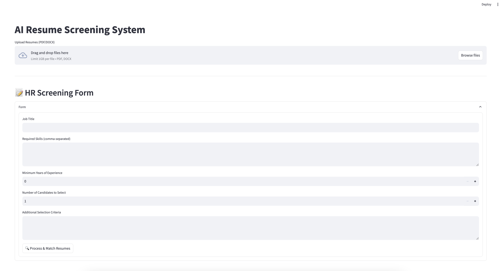
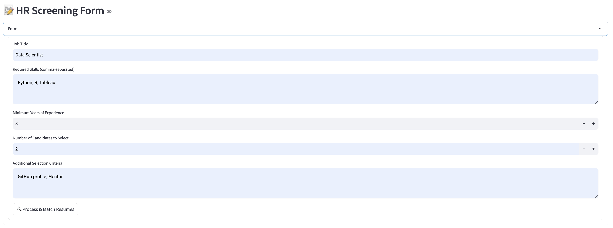

# SmartHire  
SmartHire is an AI-powered **resume screening and candidate ranking** system designed to streamline the hiring process. Using **LLM-powered justifications**, it analyzes resumes against job requirements and provides structured comparisons to help HR teams make data-driven hiring decisions.



## Form


## Candidate Comparison 
Candidature of Isabella Moore is AI Generated and is compared with the job requirements. Any resemblance to real persons, living or dead, is purely coincidental.


## 🚀 Tech Stack  

-   
-   
-   
-   
-   

## ✨ Features  

✅ **AI-Powered Resume Screening**: Compares resumes with job criteria and ranks candidates based on skills, experience, and education.  

✅ **Structured LLM Justifications**: Uses **Groq’s Gemma 2-9B** to generate structured candidate evaluations, including **Education Match, Experience Match, Skill Fit, Role Fit, and SWOT Analysis**.  

✅ **Candidate Comparison**: Displays top candidates side by side in **Streamlit columns** for easy evaluation.  

✅ **Expander for Alternative Matches**: Shows the next-best candidates with justifications.  

✅ **Resume Storage & Retrieval**: Uses **MongoDB** to store and retrieve structured resume data.  

---

## 📥 Installation  

Follow these steps to set up **SmartHire**:

### 1️⃣ Clone the repository  
```bash
git clone https://github.com/your-username/SmartHire.git
cd SmartHire
```

### 2️⃣ Set up a virtual environment
```bash
conda create --name smarthire-env python=3.13
conda activate smarthire-env
```

### 3️⃣ Install dependencies
```bash
pip install -r requirements.txt
```

### 4️⃣ Ensure the following dependencies are in requirements.txt
```txt
    streamlit==1.43.1
    pymongo==4.6.3
    langchain==0.3.20
    langchain-groq==0.2.5
    langchain-ollama==0.2.3
    groq==0.18.0
    pydantic==2.7.0
    python-dotenv==1.0.1
```

## ⚙️ Prerequisites
- Python 3.13 or higher
- MongoDB (running locally or a cloud instance)
- Required Python libraries (see requirements.txt)

## ▶️ Running the App
### 1️⃣ Start MongoDB (if running locally)
```bash
mongod --dbpath /path/to/mongodb/data
```

On Mac, if you installed MongoDB via Homebrew, you can start it using:
```bash
brew services start mongodb-community
```

### 2️⃣ Run the Streamlit app
```bash
streamlit run app.py
```
The app will be available at http://localhost:8501.

## 🏆 Usage
- 1️⃣ **Upload Resumes:** Upload candidate resumes (structured JSON format).
- 2️⃣ **Fill HR Job Criteria:** Enter required skills, experience, and education.
- 3️⃣ **AI-Powered Screening:** SmartHire ranks candidates based on the best match.
- 4️⃣ **Review Justifications:** Compare candidates side by side with structured LLM-generated justifications.
- 5️⃣ **Explore Alternative Matches:** View the next-best candidates under an expander section.

## 🤝 Contributing
Contributions are welcome! To contribute:

- Fork the repository.
- Create a new feature branch (git checkout -b feature-name).
- Commit your changes and push to your fork.
- Submit a pull request.

## 📜 License
SmartHire is open-source software licensed under the **GNU General Public License v3.0 (GPL-3.0)**.  

This means:  
- You are free to **use, modify, and distribute** the software.  
- Any modifications or derivative works **must also be open-source** under the same GPL-3.0 license.  
- For more details, see the full license text in the `LICENSE` file or visit [GNU GPL-3.0](https://www.gnu.org/licenses/gpl-3.0.en.html).  

## 🙏 Acknowledgements
- **Streamlit** for the app UI.
- **LangChain + Groq** for LLM-driven resume screening.
- **MongoDB** for candidate storage and retrieval.
- **Pydantic** for structured data validation.
