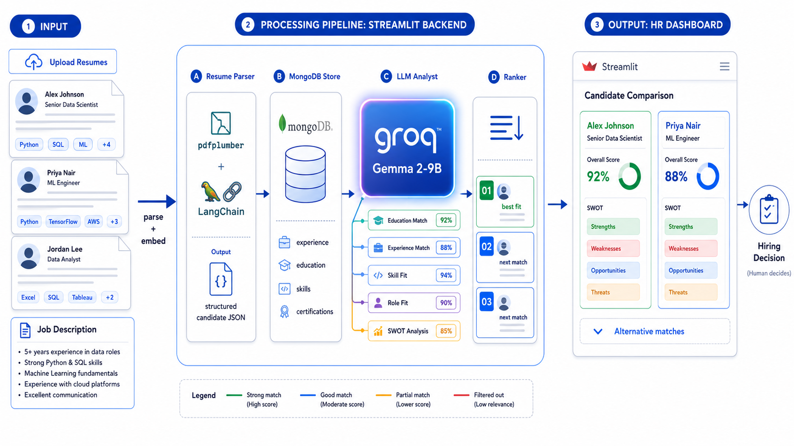
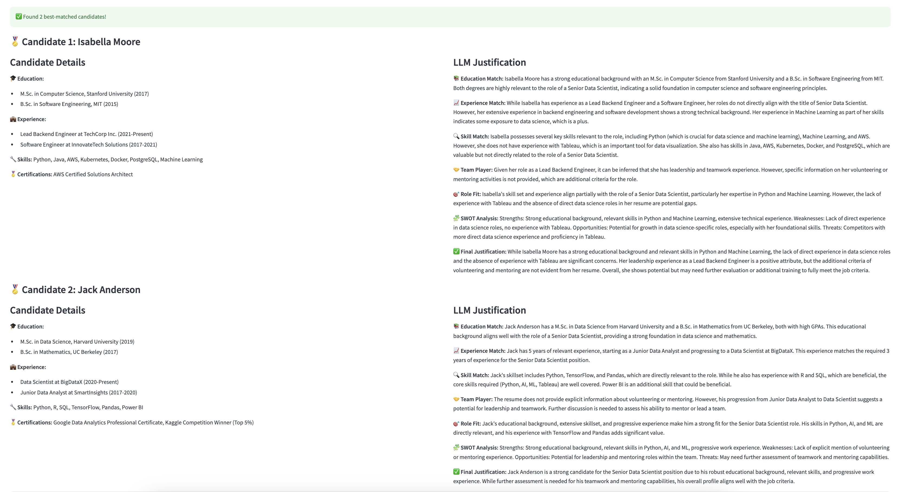
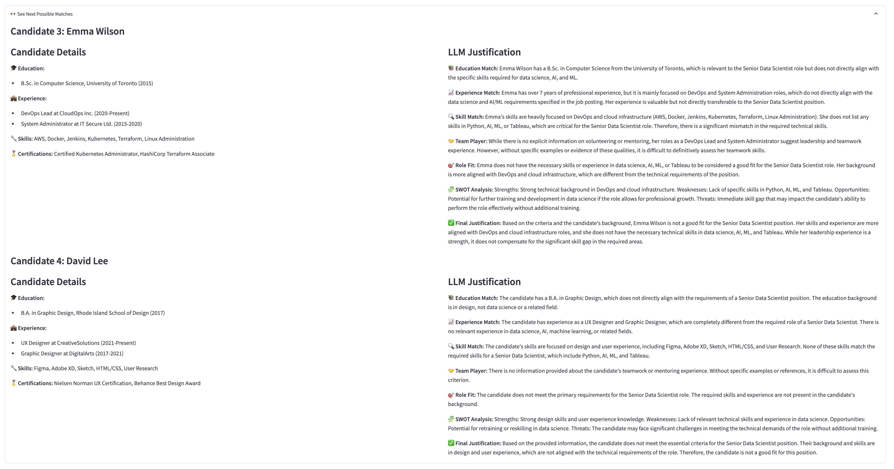

# SmartHire

> *Hiring is a two-sided problem. SmartHire is the recruiter side — read the resumes, show the work, let the human decide.*

Most resume screeners are keyword matchers — they reject 90% of candidates because the word "Kubernetes" isn't on the page. SmartHire reads instead. It uses an LLM to evaluate each resume against the job criteria on five real dimensions, ranks the candidates with structured justifications, and shows HR teams the *evidence* — not just the score.

---

## Architecture



**Pipeline:** Resume upload → `pdfplumber` parse → structured candidate JSON → MongoDB store → **Groq Gemma 2-9B** analyst (Education Match · Experience Match · Skill Fit · Role Fit · SWOT) → ranker → HR dashboard for side-by-side comparison.

The LLM produces evidence and scores across five dimensions. The human still decides. SmartHire is designed to *surface signal* — not to auto-reject candidates a keyword filter would have missed.

---

## What it does

| Stage | What happens |
|---|---|
| **Parse** | `pdfplumber` + `LangChain` extract structured candidate JSON from raw resumes |
| **Store** | MongoDB persists each candidate's parsed profile — searchable, reusable across roles |
| **Analyze** | Groq Gemma 2-9B scores each resume against the JD on five dimensions, with reasoning |
| **Rank** | Best fit, next match, alternatives — each with a confidence band and SWOT analysis |
| **Compare** | Streamlit dashboard renders top candidates side-by-side for the recruiter to review |

---

## Demo


### Job criteria input


### Side-by-side candidate comparison
*Candidates Isabella Moore, Jack Anderson, Emma Wilson, David Lee are AI-generated. Any resemblance to real persons is coincidental.*





---

## Tech Stack

| Layer | Stack |
|---|---|
| Frontend | Streamlit |
| Backend | Python · LangChain · Pydantic |
| LLM | Groq Gemma 2-9B (structured-output mode) |
| Storage | MongoDB |
| Parsing | pdfplumber |

---

## Run locally

```bash
# 1. Clone
git clone https://github.com/coding-chemist/SmartHire.git
cd SmartHire

# 2. Environment
conda create --name smarthire-env python=3.13
conda activate smarthire-env
pip install -r requirements.txt

# 3. MongoDB (local)
brew services start mongodb-community   # mac
# or: mongod --dbpath /path/to/db        # other platforms

# 4. Run
streamlit run app.py
# → http://localhost:8501
```

`.env` requires:
- `GROQ_API_KEY` — get it at [console.groq.com](https://console.groq.com)
- `MONGO_URI` — defaults to `mongodb://localhost:27017` for local

---

## Known Limitations (v0.1)

- **Single JD comparison only.** Ranks candidates against one job description at a time — multi-JD matching + role-recommendation engine on the roadmap.
- **No bias auditing yet.** The LLM judges on the criteria HR provides; it does not yet flag potentially biased criteria, demographic skew, or output patterns. Caveat emptor.
- **Local MongoDB only.** v0.1 stores resume data on a local Mongo instance; cloud-deployed multi-tenant storage planned next.
- **Final decision stays with humans.** SmartHire produces structured evidence and a ranking. It does not auto-reject or auto-hire — and won't.

---

## License

GPL-3.0. See [`LICENSE`](LICENSE).

---

## Author

**Sindhuja Sivaraman** · MSc Chemistry · MS Data Science → AI/ML Engineer
[Portfolio](https://coding-chemist.vercel.app) · [GitHub](https://github.com/coding-chemist)

> *Surface the signal. Show the work. Let the human decide.*
